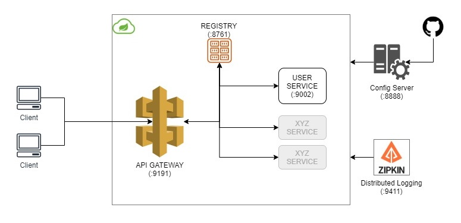

<h1>Spring Cloud Microservice Architecture</h1>

# Overview

This is a demo spring micro-service architecture with the following components:

* Service Registry with Netflix Eureka responsible for registering all our services. 
* API Gateway with Spring Cloud Gateway allowing for a single entrypoint to our micro-service architecture. 
* User Service with Spring Boot for managing users with a basic CRUD API. 
* Configuration Server with Spring Config Server which retrieves common configuration for all services that need to register with Netflix Eureka. 
* Distributed Logging with Zipkin & Sleuth for troubleshooting and tracing requests. 
* Circuit Breaker with Spring Cloud Resilience4J for fault tolerance. 
