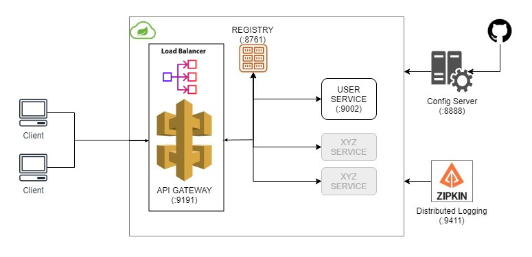

<h1>Spring Cloud Microservice Architecture</h1>



# Overview

This is a demo spring micro-service architecture with the following components:

* Service Registry with Netflix Eureka responsible for registering all our services.<br>
* API Gateway with Spring Cloud Gateway allowing for a single entrypoint to our micro-service architecture.<br>
* User Service with Spring Boot for managing users with a basic CRUD API.<br>
* Configuration Server with Spring Config Server which retrieves common configuration for all services that need to register with Netflix Eureka.<br>
* Distributed Logging with Zipkin & Sleuth for troubleshooting and tracing requests.<br>
* Circuit Breaker with Spring Cloud Resilience4J for fault tolerance.<br>

# user-service-02: project demo for spring cloud vault

**Step 1**: Intall vault cli [a link](https://developer.hashicorp.com/vault/tutorials/getting-started/getting-started-install)

**Step 2**: Start Vault server
```bash
vault server --dev --dev-root-token-id="your-token"
```
&nbsp;example: vault server --dev --dev-root-token-id="00000000-0000-0000-0000-000000000000"

**Step 3**: Using the CLI to perform operations on Vault
- Write key-value pairs
```bash
vault kv put secret/your-app-name app.username=demo app.password=admin
```

- Read key-value pairs
```bash
vault kv get secret/your-app-name
```

- Delete key-value pairs
```bash
vault kv delete secret/your-app-name
```

### \* Client Side Usage
##### application.yml
```yaml
spring:
  application:
    name: USER-SERVICE
  cloud:
    vault:
      uri: http://localhost:8200
      kv:
        enabled: true
        backend: secret
        application-name: your-app-name

  config.import: vault://
```
If you configure ***spring.cloud.vault.kv.application-name***, your app will load data from the path ***your-app-name***, otherwise, if you do not configure it, it defaults to ***spring.application.name*** is USER-SERVICE.
